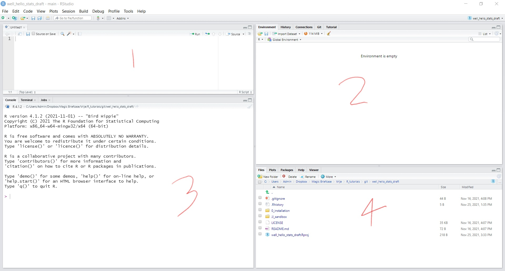
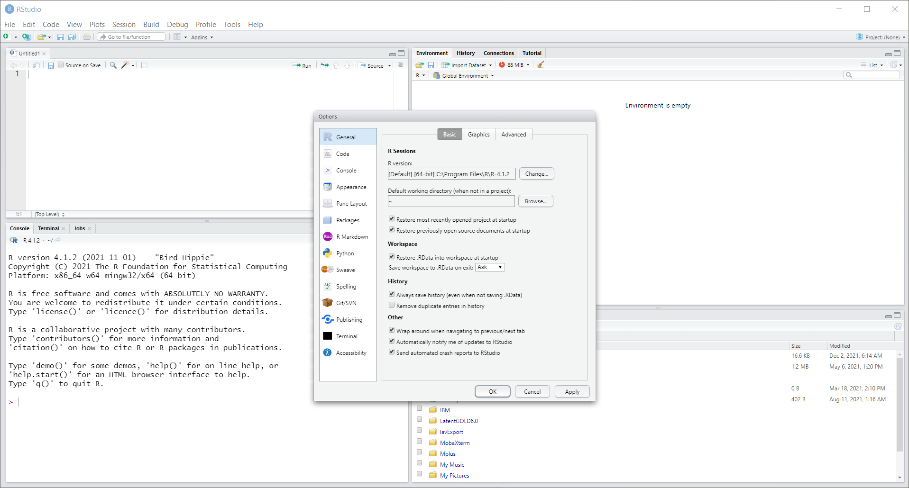
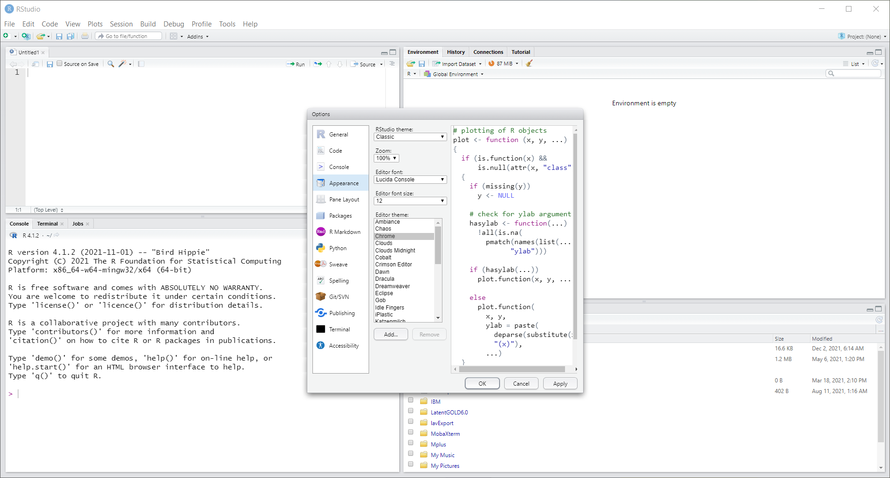
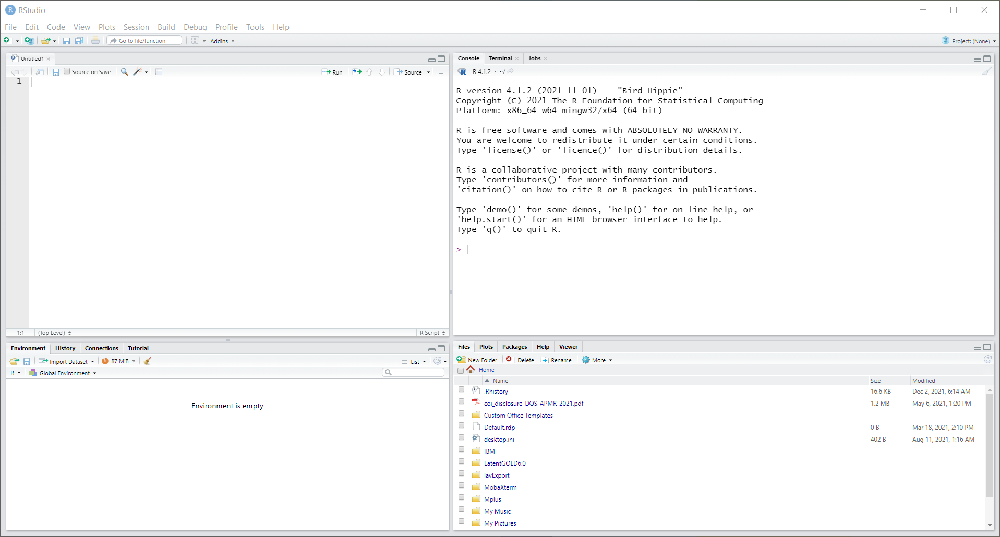
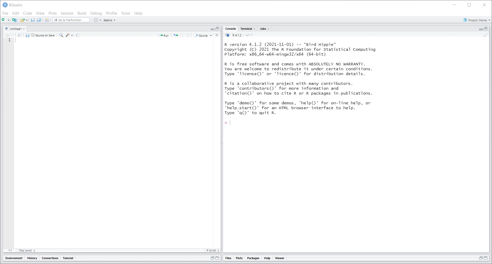
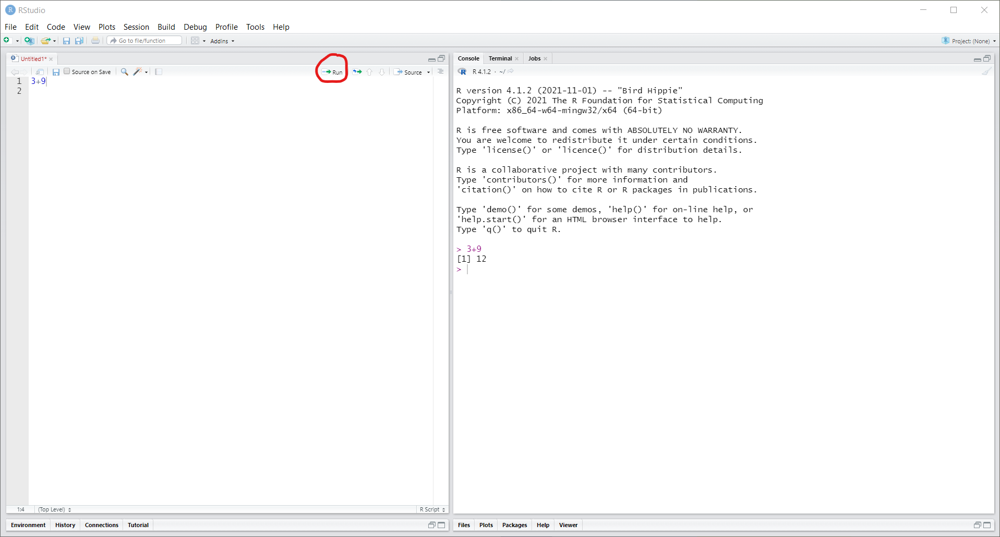

Setting up RStudio
================
Mauricio Garnier-Villarreal, Joris M. Schröder & Joseph Charles Van
Matre
01 September, 2022

-   <a href="#rstudio-panes" id="toc-rstudio-panes">RStudio panes</a>
    -   <a href="#syntax-use" id="toc-syntax-use">Syntax use</a>
    -   <a href="#change-apperance" id="toc-change-apperance">Change
        apperance</a>

We recommend to work with **R** in an editor, there are several options,
and we will use **RStudio**. So in this tutorial we will take a look at
**RStudio** and how to use it.

# RStudio panes

This editor is organized in *panes*, these are the 4 mayor spaces and
how we interact with **R**. We you open it it will look like this, I
have (poorly) label the panes with numbers.

## Syntax use

**Pane 1** is the syntax, where we will be writing code and *send* it to
run. **Pane 2** has several uses as you can see in tabs, the one that is
used more is the *Environment* tab. This tab will show which objects are
created and can be used in our analysis. **Pane 3** is the *Console*,
which is actually **R**, where we run analysis and will see the results.
You can see in here we can see the version we have installed and some
information about **R**. Finally, **Pane 4** also has multiple uses as
you can see on the tabs, but the ones we will use more are *Plots* and
*Packages*.

From this we can see that the 2 panes we will use the most are **1** and
**3**. As these will have will have our syntax and results, even as the
panes sizes can be adjusted I recommend to adjust the layout of these
panes so we can have panes 1 and 3 next to each other.

## Change apperance

In general we can adjust how we want to interact and the aesthetic of
**RStudio**. For this we will go to the top tabs: *Tools \> Global
Options*. When we get here, you can customize how you want **RStudio**
to look. Here we will look at only two of these options

Firs you can go to the **Appearance** tab, here you can change the font
size, zoom and theme, for example if you want dark screen. When I teach,
I usually increase the font so students can see the screen easier in the
classroom.

The next one, we will look at **Pane layout** tab. Here you can adjust
where do you can each of the 4 panes. My recommendation is to have the
syntax and console next to each other. Once you do this can click **OK**
to apply the changes you made

Once we do these changes, we will have the same panes with the new
arrangement. Here we see the new layout, with the syntax and console
next to each other.

When working with larger projects, I find this useful to have these 2
panes take other the whole screen, allowing us to see the syntax and
results easier

Now, lets see how to run a simple line of code from the syntax to the
console (**R**). The most basic use is as a calculator, so lets make a
calculation on the syntax pane. Lets write **3+9** on the syntax pane,
then you have 2 ways to send it to *run* on the console. While having
the mouse cursor on the same line as your code, click the **run** button
on the top right of the syntax pane. The second is (while having the
mouse cursor on the same line as your code), click **ctrl+enter** in
your keyboard. After doing this you can see the calculation done in the
console

With this we have seen how to set up and modify how we want to interact
with **RStudio**, and run code to the console.
